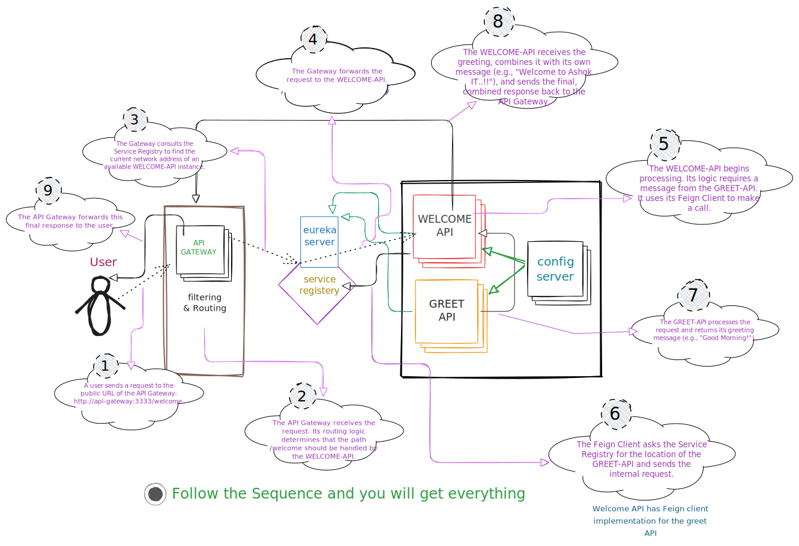
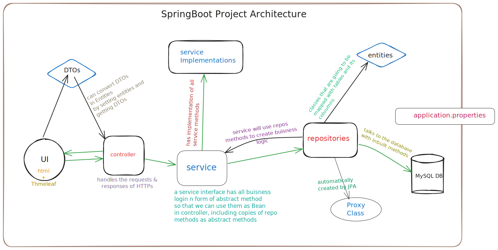

# 🚀 Spring Boot + Microservices Workspace


> 📚 A **complete Spring Boot learning repository** — from IoC & Dependency Injection basics to building **SpringBoot + Microservices**.  
> Includes **step-by-step code examples** and **personal notes** 📒 for revision.

---

## 🏗 Architecture of a Microservices Enviourment Setup
Here’s the high-level Microservices application architecture:



---

## 🏗 Architecture of a Standard SpringBoot Project
Here’s the high-level Spring Boot application architecture:



---

## 📖 Table of Contents + Notes  

| **Table of Contents** | **Notes** |
|------------------------|-----------|
| [Overview](#-overview) | [01 - Introduction Notes](Notes/14.%20Introduction%20Notes.txt) |
| [Learning Roadmap](#-learning-roadmap) | [02 - Spring Core Notes](Notes/13.%20Spring%20Core%20Notes.txt) |
| [Architecture](#-architecture) | [03 - Spring Boot Basics](Notes/12.%20Spring%20Boot%20Notes.txt) |
| [Tech Stack](#-tech-stack) | [04 - Spring MVC Notes](Notes/09.%20Spring%20Web%20MVC.txt) |
| [Getting Started](#-getting-started) | [05 - Spring Data JPA Notes](Notes/10.%20Data%20JPA%20Notes.txt) |
| [Contributing](#-contributing) | [06 - Security Notes](Notes/06.%20Spring%20Security%20Notes.txt) |
| [License](#-license) | [07 - Microservices Notes](Notes/07.%20Microservices%20Notes.txt)<br>[08 - Rest API Notes](Notes/08.%20REST%20API%20Notes.txt) |

---

## 📝 Overview
This repository is designed as a **self-paced course + code workspace** for mastering **Spring Boot and Microservices**.  

Each module folder contains:
- ✅ **Code examples**  
- ✅ **Excalidraw diagrams**  
- ✅ **Notes (txt files)** for revision  

---

## 🛤 Learning Roadmap
| Module | Topics Covered |
|--------|----------------|
| **01 - IoC & DI** | Inversion of Control, Dependency Injection |
| **02 - Spring Core** | Beans, ApplicationContext, Bean Lifecycle |
| **03 - Spring Boot Basics** | Starters, AutoConfig, Profiles |
| **04 - Spring MVC** | Controllers, REST APIs, Thymeleaf |
| **05 - Spring Data JPA** | Entities, Repositories, Queries |
| **06 - Security** | Authentication, Authorization |
| **07 - Microservices** | Service Discovery, API Gateway |

---

## 🛠 Tech Stack
- **Java 17+**  
- **Spring Boot 3+**  
- **Spring Data JPA**  
- **Hibernate**  
- **Thymeleaf**  
- **Spring Security**  
- **MySQL**  


---

## 🚀 Getting Started
```bash
# clone repo
git clone https://github.com/ranjeetkumar274/SpringWorkspace.git
cd SpringWorkspace

# run a specific module
cd 03-spring-boot-basics
./mvnw spring-boot:run
